# Step1: Accessing The Server
- Open the server manager, select manage, and click on ' **Add Roles and Features** '
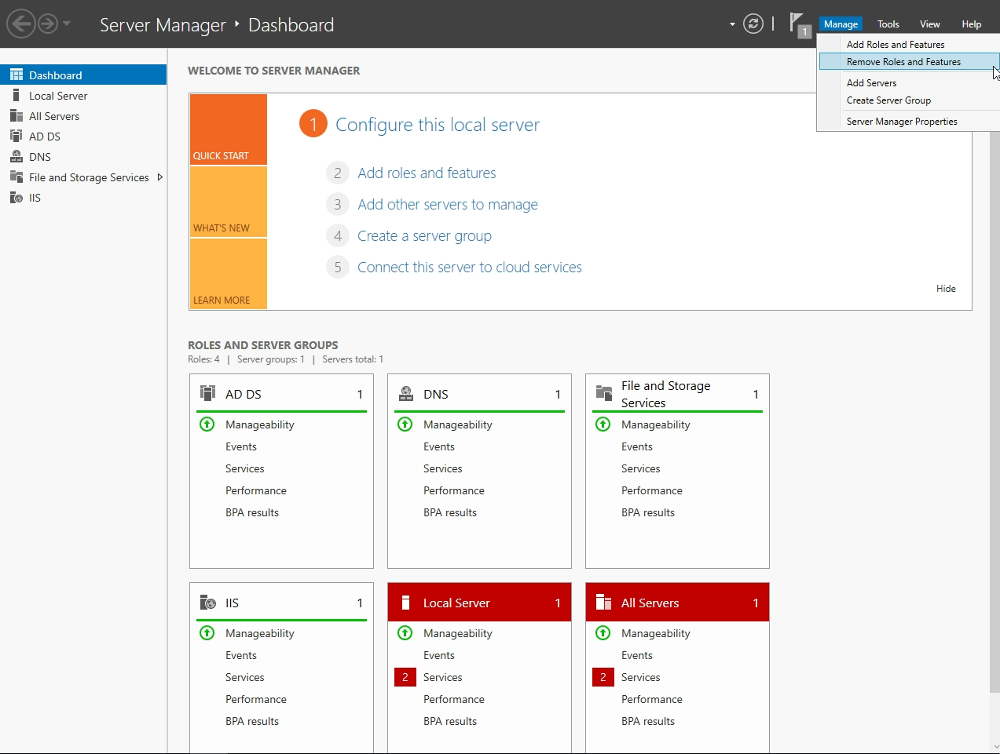
# Step 2: Wizard Configuration
- Likewise, when installing the **AD** server, when installing the **WSUS** server, after clicking next and getting to the **Server Roles**, Scroll down and click the empty box next to **Windows Server Update Services**
- Since this is a simulated lab environment, I went ahead and left the **SQL** services unchecked, however depending on your environment, you are able to do as you see fit
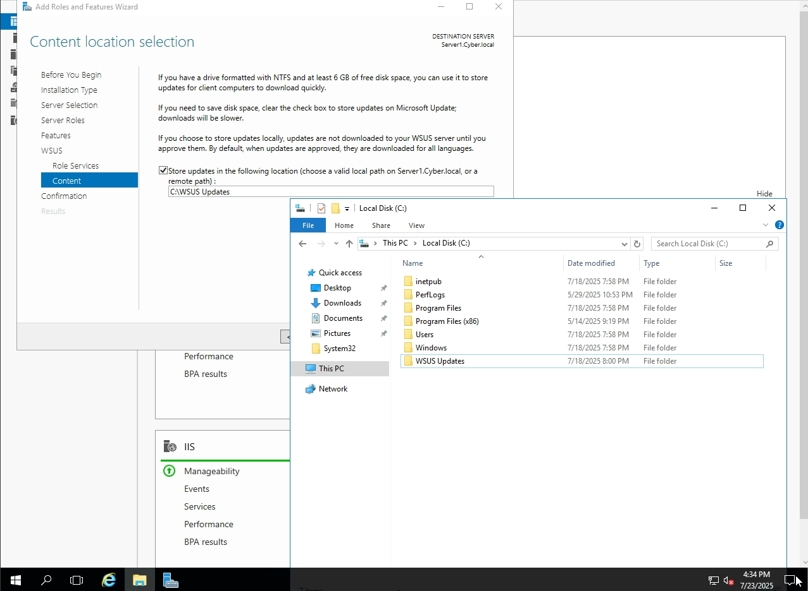
- In this lab environment, we are going to store the updates locally, and we do that by creating a file on the local disk on the Server Computer
- Name it **WSUS Updates**, and from there(depending on what you named yours) you are going to check off the box where its states " **Store Updates In The Following** ", and copy the path to that folder as noted: **C:\WSUS Updates**
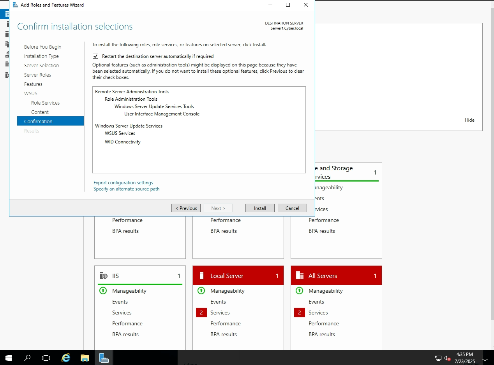
- Once you've gone over your settings, and feel that you've made the appropiate choices, go ahead and click **Next** and lastly select **Install**
# Step 3: Post Deployment
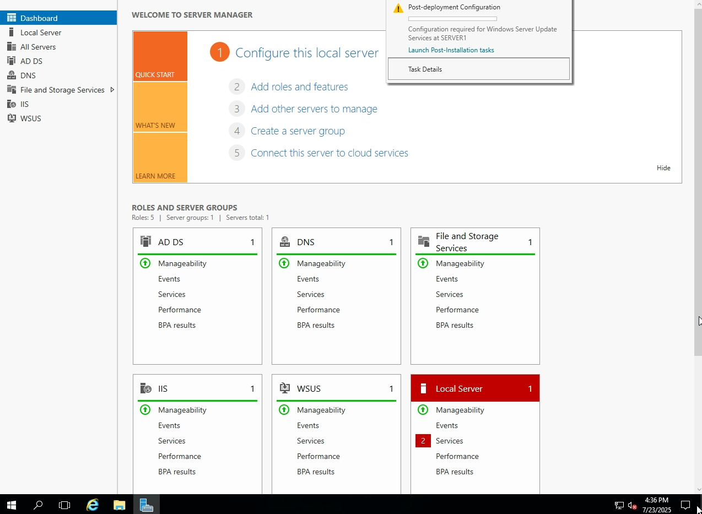
- When the **WSUS** completes its installation, you'll notice again that at the top of the Server Manager, the flag has a yellow caution next to it
- Click on the flag, and select '**Launch Post-Installation Tasks**'
# Step 4: Configuring The GPO
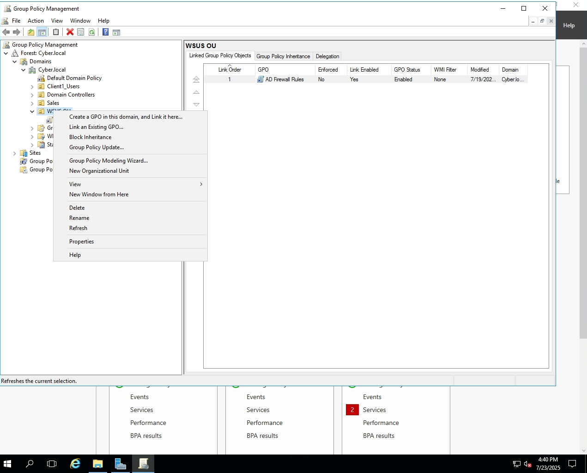
- For the configuration of the WSUS Server, head to the top of the Server Manager -> **Tools** -> and look for **Group Policy Management**
- On the **OU**(Organizational Unit) that contains the computer in which you intend to configure WSUS to, right click on it and select the first option that states **Create a GPO in this domain, and Link it here...**
# Step 5: GPO Configuration
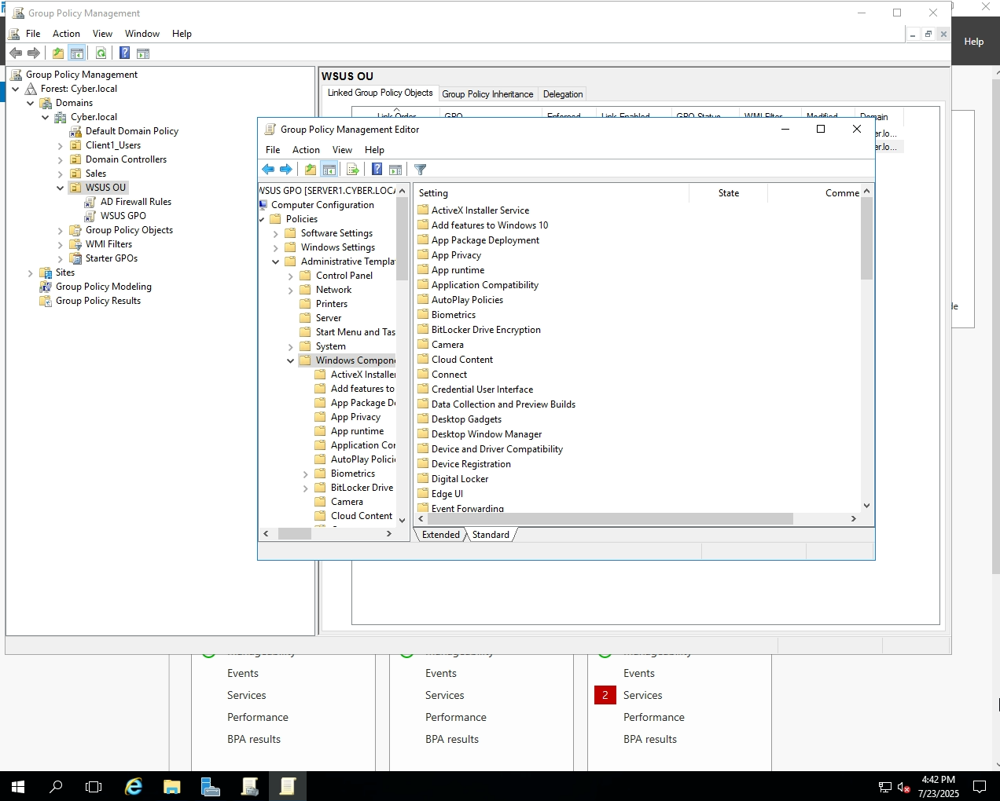
- From there naviate to **Computer Configuration** -> **Policies** -> **Administrative Templates** -> **Windows Components** -> **Windows Update**
# Step 7: Intranet Settings
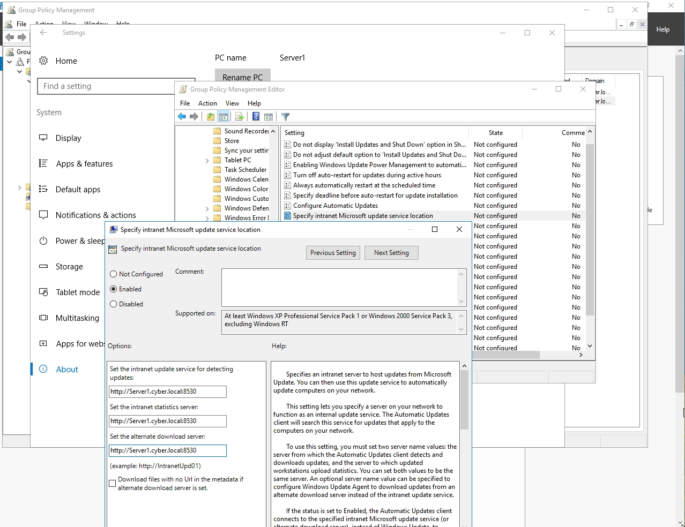
We're configuring the "**Specify intranet Microsoft update service location**" GPO so that client machines receive updates only from our WSUS server, allowing us to control which updates are approved and deployed internally instead of having clients download them directly from Microsoft
- Select **Enabled**, and in the options area where you would see 3 blank spaces you will type in "**http://(Server Computer Name)(Name Of Server):8530**". Select **Apply** and **OK** after doing so.
# Step 8: Configuring Automatic Updates
We configure the "Configure Automatic Updates" setting so that client machines know how and when to install updates once they're approved by the WSUS server. Without this setting, clients may not check for updates regularly or may not install them at all, even if WSUS approves them
- Under the same **Windows Update** folder, now navigate to -> **Configure Automatic Updates** and select **Enabled**. Select **Apply** -> and then **Ok** after doing so
In this demo we left these settings alone, however as noted before, you would configure these settings based on **YOUR** needs, for this is just a basic walkthrough
# Step 9: Automatic Updates detection frequency
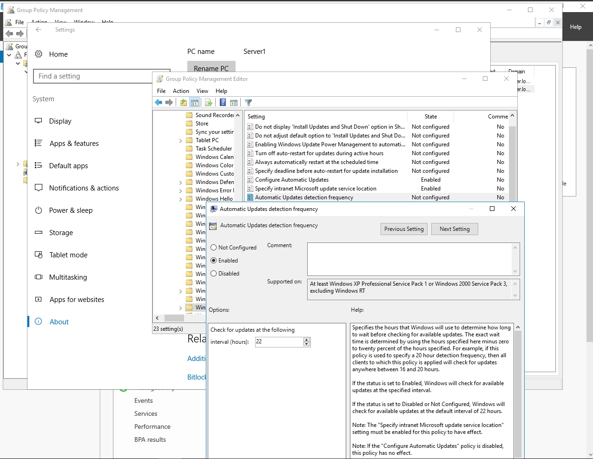
How often clients check for updates emtirely depends on the environment they are in. To ensure that machines regularly contact the WSUS server and receive newly approved updates in a timely manner, we configure the **Automatic Update detection frequency**. Without this, clients might only check once every 22 hours (the Windows default), which could delay important updates — especially in fast-paced or high-security environments. In this lab we leave the settings as is, nonetheless, configure it based upon your needs.
- Under the same **Windows Update** folder, now navigate to -> **Automatic Updates detection frequency** and select **Enabled**. After, select **Apply** and **OK** after doing so.
# Step 10: Delegation Settings
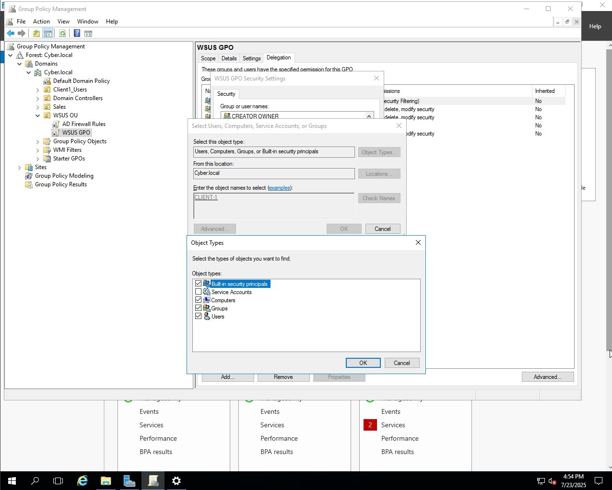
- After configuring the settings above, exit out of the **GPO Editor** and navigate to the  -> **Delegation** tab on the **WSUS GPO**
- Select **Advanced** -> **Object Types** and check of the **Computers** option. After, in the "Enter the object names" box, type in the name of the computer you wish to add and select **OK**. We do this so we can apply full permissions so it will be able to interact with the WSUS server.
- Next, under the **WSUS GPO Security Settings** for the **Authenticated Users** and your **Computer Name**, give both groups the "**Full control**" set of permissions. Select **Apply** and **OK** after doing so.
# Step 11: Enforcing the Policy Changes
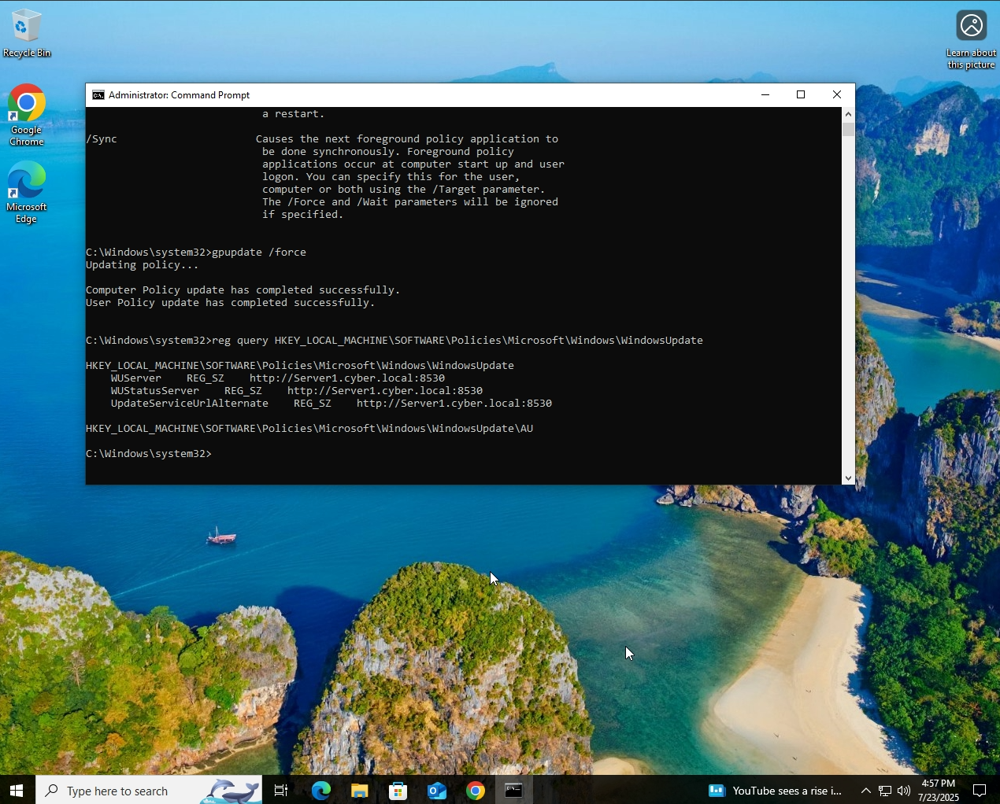
- To enforce the policy changes, on the client computer, open **Command Prompt** and run **gpupdate /force** command to update the new policy changes made for the client device. And to ensure that the **WSUS GPO** changes were done correctly, run "**reg query HKEY_LOCAL_MACHINE\SOFTWARE\Policies\Microsoft\Windows\WindowsUpdate**". You should see that any updates the Client Devices receives will be coming from your server. If anything is off, run through the steps again to ensure that the settings were done properly. 
# Steo 12: WSUS Server Configuration
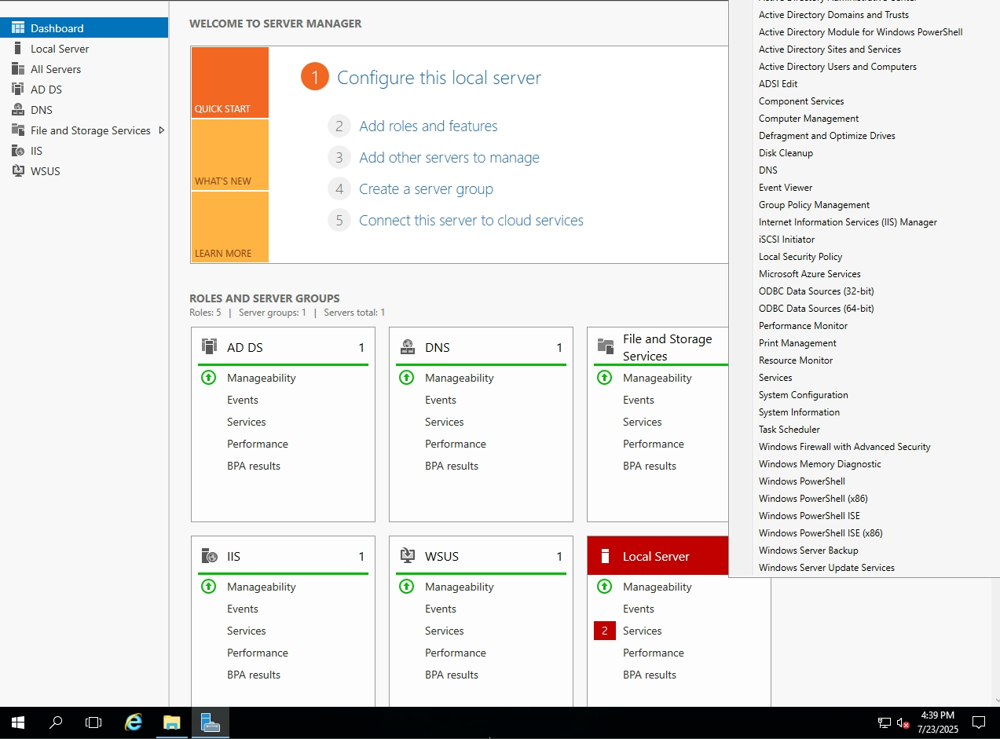
The first time you open the WSUS Server, you will be prompted with a setup wizard to configure the settings needed for the WSUS Server, such as, what updates you would want/need for the client devices on the **WSUS Server**. Go ahead and configure the settings as you see fit for your environment, and wait for the **SYNC** process to complete
- Back on the **Server Manager** open up the **Tools** drop down, and at the bottom, select **Windows Server Update Services**.
- After the **SYNC** is complete, give the **WSUS** a couple of minutes to update. Navigate to **The Name Of Your Server** -> **Computers** click on the drop down, and select **All Computers**.
- On the **Status** portion select **Any** and hit the **Refresh** button.
And with everything configured correctly you should have this:

## **Congrats , You've Configured Your First WSUS Server**
